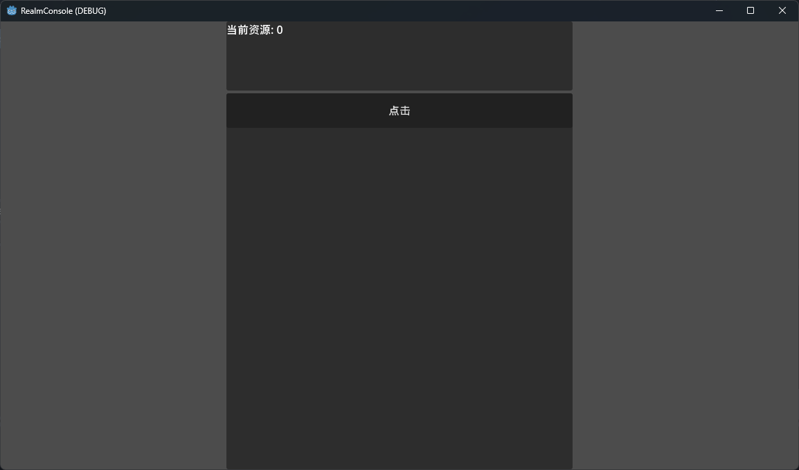
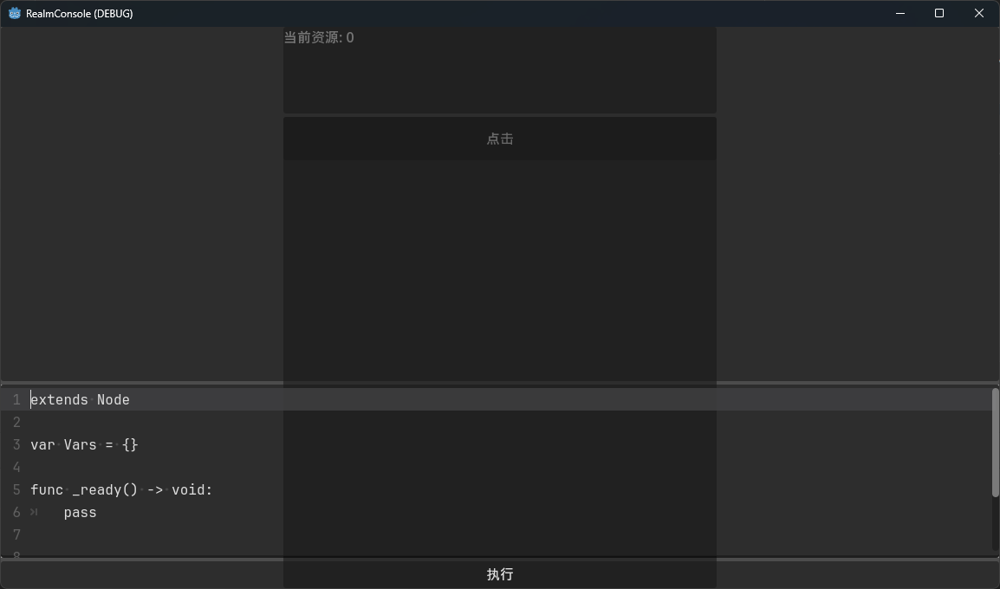
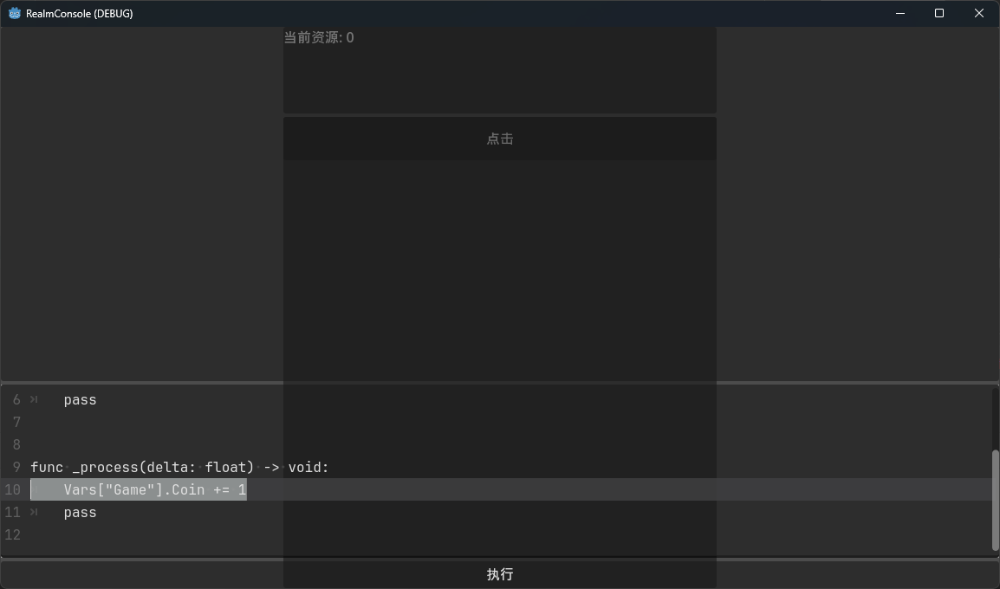
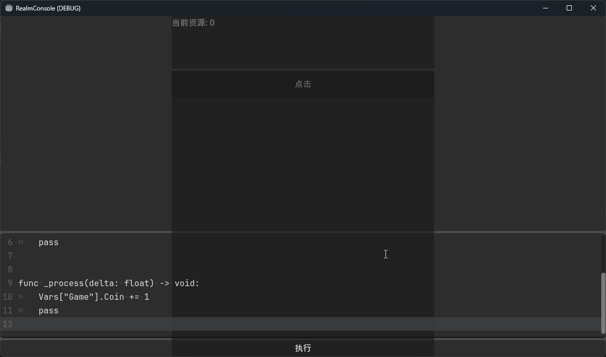

# 境界Console

[![Read the docs][read-the-docs-badge]][docs] [![Chickensoft Badge][chickensoft-badge]][chickensoft-website] ![line coverage][line-coverage] ![branch coverage][branch-coverage]

境界Console是一个Godot 4 编辑器插件。它提供了一个游戏内控制台，可以在运行时执行GDScript代码。

RealmConsole is a Godot 4 editor plugin. It provides an in-game console that allows you to execute GDScript code at runtime.

---

## 🥚 快速开始

> **⚠** 已过时，待更新

此仓库是一个示例游戏（大概可以称为“游戏”吧）
* 在Godot编辑器中运行此游戏

* 按下`` ` ``键呼出控制台

* 在`_process`的方法体中添加语句`Vars["Game"].Coin += 1`，并按下“执行”按钮

* 可观察到脚本运行效果：“当前资源”数字在不断增加

## 💁 获取帮助

待补充

---

🐣 项目使用了 🐤 Chickensoft 模板 — <https://chickensoft.games>

🐣 Package generated from a 🐤 Chickensoft Template — <https://chickensoft.games>

<!-- Links -->

<!-- Header -->
[chickensoft-badge]: https://raw.githubusercontent.com/chickensoft-games/chickensoft_site/main/static/img/badges/chickensoft_badge.svg
[chickensoft-website]: https://chickensoft.games
[discord-badge]: https://raw.githubusercontent.com/chickensoft-games/chickensoft_site/main/static/img/badges/discord_badge.svg
[discord]: https://discord.gg/gSjaPgMmYW
[read-the-docs-badge]: https://raw.githubusercontent.com/chickensoft-games/chickensoft_site/main/static/img/badges/read_the_docs_badge.svg
[docs]: https://chickensoft.games/docs
[line-coverage]: badges/line_coverage.svg
[branch-coverage]: badges/branch_coverage.svg

<!-- Article -->
[GoDotTest]: https://github.com/chickensoft-games/go_dot_test
[setup-docs]: https://chickensoft.games/docs/setup
[cspell]: https://marketplace.visualstudio.com/items?itemName=streetsidesoftware.code-spell-checker
[Renovatebot]: https://www.mend.io/free-developer-tools/renovate/
[get-renovatebot]: https://github.com/apps/renovate
[godot-test-driver]: https://github.com/derkork/godot-test-driver
[coverlet-issues]: https://github.com/coverlet-coverage/coverlet/issues/1422
[GodotSharp]: https://www.nuget.org/packages/GodotSharp/
[chickensoft-games/setup-godot]: https://github.com/chickensoft-games/setup-godot
